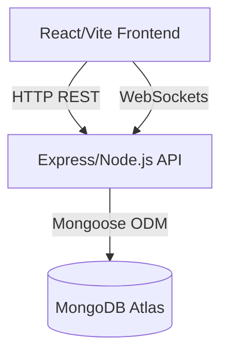

# SynchBoard - Real-time Collaborative Workspace

SynchBoard is a full-stack MERN application that provides a real-time, drag-and-drop Kanban board for personal and team task management. It was built progressively across 5 sessions to meet all mandatory technical requirements.

## 🏛️ Architecture & Tech Stack



### Tech Stack
*   **Frontend:** React, TypeScript, Vite, Tailwind CSS, @dnd-kit (Drag and Drop), Framer Motion, Vitest + React Testing Library (Testing).
*   **Backend:** Node.js, Express, Socket.io (WebSockets), Jest + Supertest (Testing).
*   **Database:** MongoDB Atlas, Mongoose (ODM).
*   **DevOps:** Docker, Docker Compose, GitHub Actions (CI Pipeline), Vercel (Deployment).

## 🛠️ How to Run the Project Locally

### Option 1: Using Docker Compose (Recommended)
Make sure you have Docker Desktop installed and running.
1. Clone the repository and navigate to the project root.
2. Run the following command:
   ```bash
   docker-compose up --build
   ```
3. The frontend will be available at `http://localhost:5173` and the backend API at `http://localhost:5000`.

### Option 2: Manual Setup
#### Setup the Backend
1. `cd backend`
2. `npm install`
3. Create a `.env` file with `PORT=5000`, `MONGO_URI=your_mongo_url`, `JWT_SECRET=secret`, `FRONTEND_URL=http://localhost:5173`.
4. `npm run dev`

#### Setup the Frontend
1. `cd frontend`
2. `npm install`
3. Create a `.env` file with `VITE_API_URL=http://localhost:5000`.
4. `npm run dev`

## 🚀 Deployment Links
*   **Live App URL:** https://synch-boardfinal.vercel.app/
*   **Repository:** https://github.com/thisal-wtc/SynchBoardfinal-

## 🔄 Approach to Concurrent Edits
We handle concurrent edits using **Optimistic Concurrency Control (OCC)** provided natively by Mongoose (`optimisticConcurrency: true` & `__v` version key). 
If User A and User B load the same task (v1), and User A moves the task to "Done" (saving as v2), when User B tries to simultaneously move that task to "In Progress" (submitting v1), the database detects the version mismatch and rejects User B's update with a `VersionError` (409 Conflict). The frontend catches this error and surfaces it to the user, prompting them to refresh and fetch the latest changes, preventing silent data overwriting.

## ⚠️ Known Limitations
*   Due to Vercel's serverless environment, persistent WebSockets (Socket.io) can occasionally drop connection on inactivity. We mitigate this by falling back to REST API polling and cache invalidation.
*   The Free Tier MongoDB Atlas cluster has limited connection pooling, which might cause initial cold-start delays.

---

## 👥 One-Page Team Reflection

### What Worked Well
*   Adopting a component-driven design in React made it extremely easy to reuse the Kanban column and task cards across personal and team boards.
*   Tailwind CSS accelerated our UI development drastically, allowing us to build a premium, glassmorphism-themed interface without writing hundreds of lines of custom CSS.

### What We Would Do Differently
*   We would introduce a state-management library like Redux Toolkit or Zustand earlier. Relying heavily on React Context for complex board states caused some unnecessary re-renders.
*   We would deploy our backend to a stateful container service (like Render or AWS App Runner) instead of Vercel Serverless to ensure flawless, uninterrupted WebSocket connections.

### Division of Work
*   **[Member 1 Name]:** Handled the React frontend, Tailwind styling, and Drag-and-Drop functionality using `@dnd-kit`.
*   **[Member 2 Name]:** Developed the Express backend REST APIs, MongoDB schema design, JWT Authentication, and implemented optimistic concurrency control.
*   **[Member 3 Name]:** Setup Docker, GitHub Actions CI Pipeline, wrote Jest test suites for both client and server, and managed the Vercel deployment.
